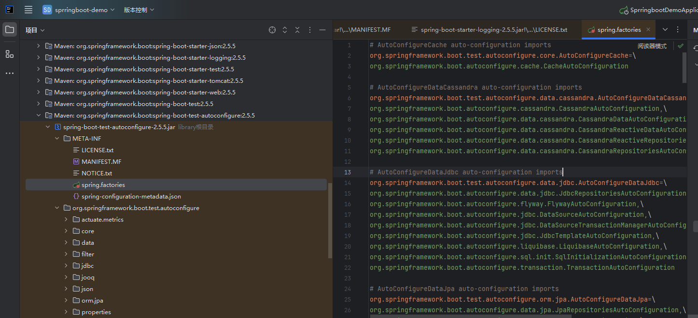
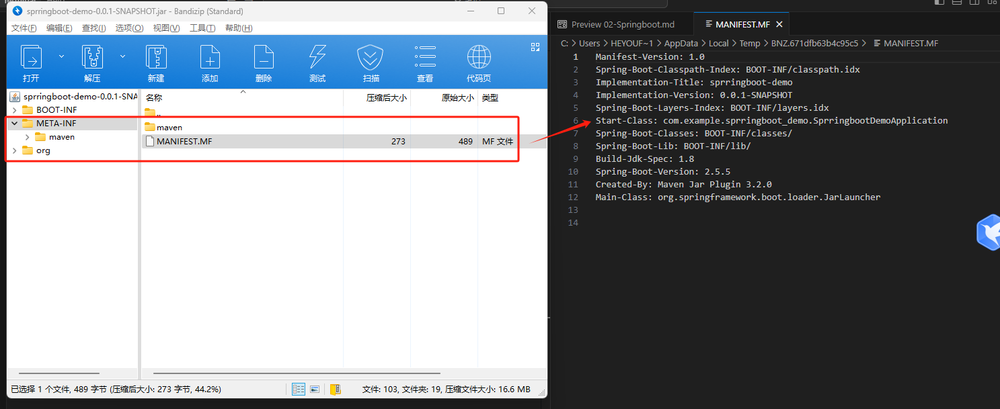
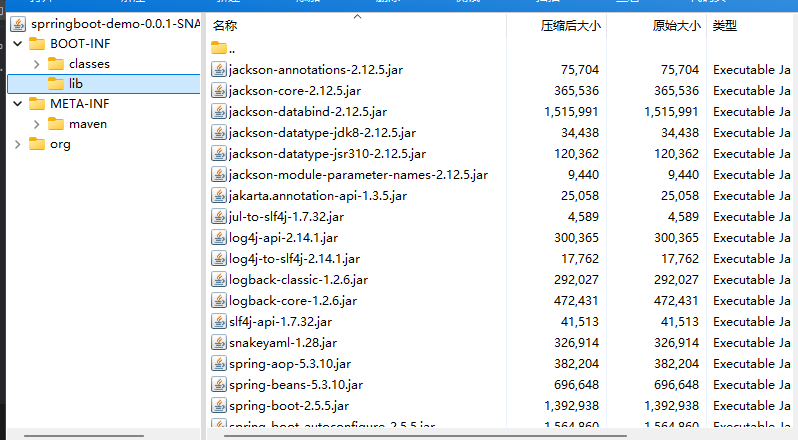
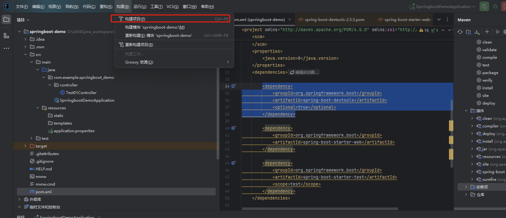

# Spring Boot 的核心注解是哪个

@SpringBootApplication

- @SpringBootConfiguration:组合了 @Configuration 注解，实现配置文件的功能。
- @EnableAutoConfiguration: 打开自动配置的功能，也可以关闭某个自动配置的选项.
- @ComponentScan: Spring组件扫描。

#  Spring Boot 支持哪些日志框架？推荐和默认的日志框架是哪个？

logback(默认使用), log4j2

# SpringBoot Starter的工作原理

首先springboot starter的工作原理借鉴了，java中SPI的思想。springboot回去读每个starter下面的文件，并加载这些类

```
src
└── main
    └── resources
        └── META-INF
            └── spring.factories
```
``` 
org.springframework.boot.autoconfigure.EnableAutoConfiguration=\
com.example.autoconfiguration.MyAutoConfiguration,\
com.example.autoconfiguration.AnotherAutoConfiguration

```



# springboot打成的jar和普通的jar有什么区别

## 1. 可执行性
Spring Boot JAR：通常是可执行的，包含一个 Main-Class 属性指向 Spring Boot 的启动类。可以直接使用 java -jar yourapp.jar 命令运行。



## 2. 嵌入式服务器

通常内嵌了一个服务器（如 Tomcat、Jetty 或 Undertow），这使得应用可以独立运行，不需要外部的服务器环境。

## 3. 依赖管理

打包时会自动将所有的依赖项打入 JAR 包中，形成一个 "fat JAR" 或 "uber JAR"。这使得所有依赖能够被应用直接使用，简化了部署过程。

通常只包含自身的代码和资源，依赖项需要单独管理（通常通过 Maven、Gradle 等）。




## 4.配置和约定
- Spring Boot JAR：采用约定优于配置的原则，许多配置可以通过 application.properties 或 application.yml 文件进行设置，提供了更方便的配置管理。
- 普通 JAR：通常需要更多的手动配置，尤其是在依赖和环境设置上。


# 热部署

maven添加
```java

<dependency>
    <groupId>org.springframework.boot</groupId>
    <artifactId>spring-boot-devtools</artifactId>
    <optional>true</optional>
</dependency>

```



严格意义上来说 Spring Boot DevTools不算是一个热部署，算一个热重启模式。

生产的热部署可以参看美团的文章
[Sonic网址](https://tech.meituan.com/2022/03/17/java-hotswap-sonic.html)

不过遗憾，好像Sonic只能美团内部使用，所以只有使用Jrebel可以实现本地的热部署和远程的热部署。 //todo


